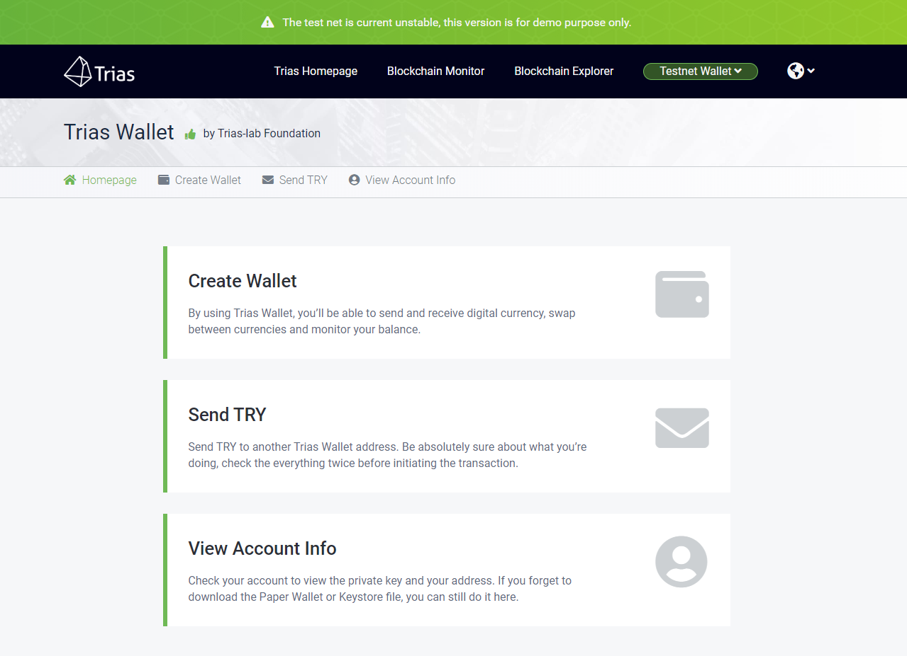
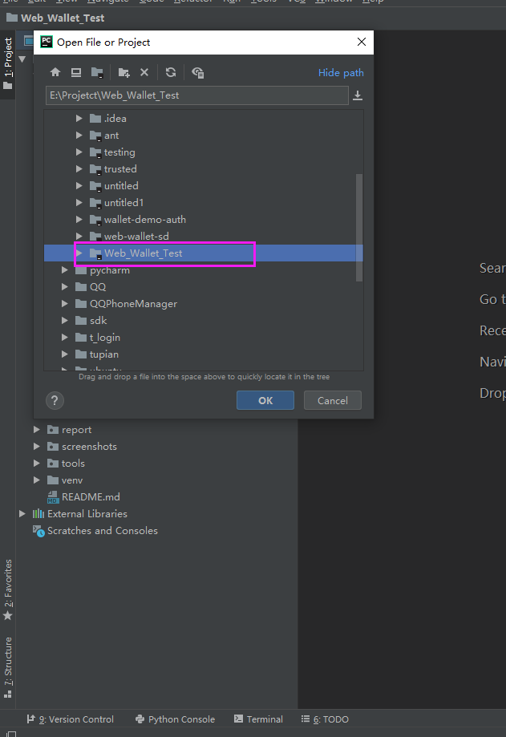
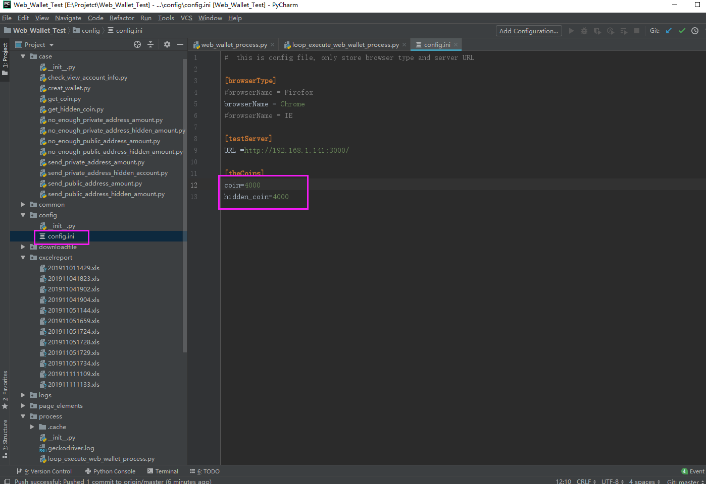
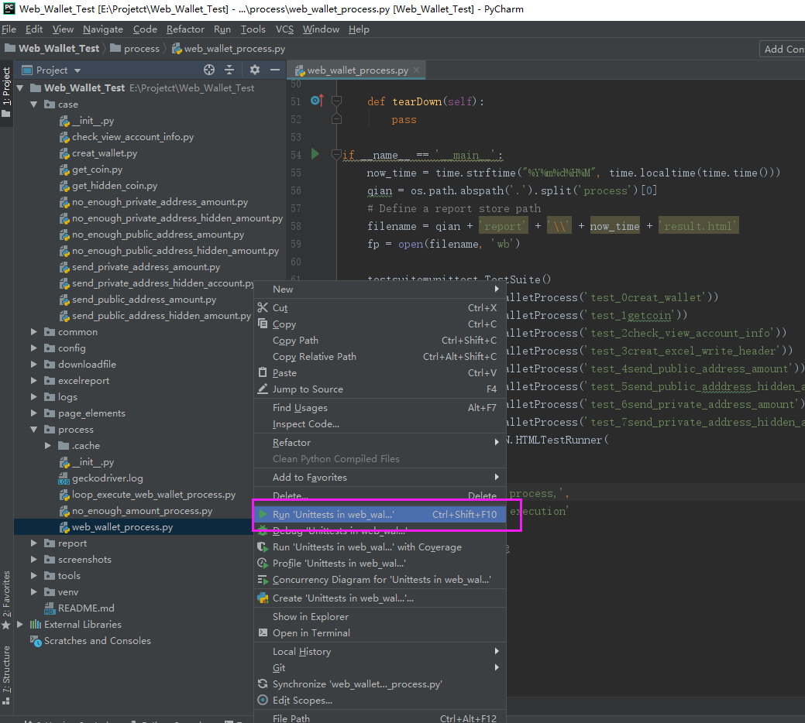
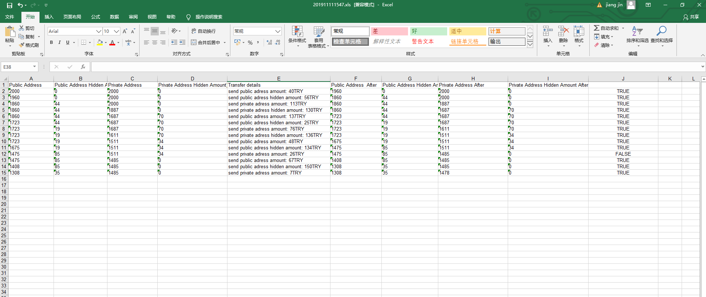
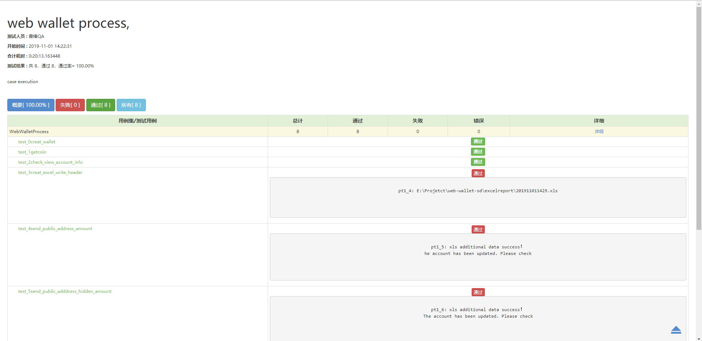

# Web Wallet Auto Test 
Trias Web Wallet is an open-source, easy-to-use and secure client-side wallet for easily & securely interacting with the Ethereum and Trias network. 
See: https://wallet.trias.one/



## **Installation Environment**

  - ubuntu 14+
  - python v3.6.8+
  - Chrome v78.0.3904.70
  - chromedriver v78.0.3904.11
  - pycharm 
  


## **Installation Steps**

#### **Git clone**
```shell
$ git clone https://github.com/trias-lab/testing.git
$ cd testing
```

#### **Enter wallet folder**

```shell
$ cd web_wallet
```

#### **Install dependency package**
```shell
$ pip install selenium
$ pip install xlrd
$ pip install pytest
```


#### **Copy HTMLTestReportCN.py**

```shell
$ cd tools
$ which python3
/Library/Frameworks/Python.framework/Versions/3.8/bin/python3
$ cp HTMLTestReportCN.py  /Library/Frameworks/Python.framework/Versions/3.8/lib  

```

## **Import wallet project**
Start pycharm from the desktop, and click "file" - > "open" to open the wallet folder


## **Set TRY account amount**
After opening the wallet project, enter the config directory, and enter the config.ini file,then set the coin and hidden_coin


## **Run script**
 After opening the wallet project, enter the process directory, and enter the walletprocess.py file

Right click to run ‘pytest in web_wallet_process.py’ 

## **Test excelreport**
You can view it in the ‘excelreport’ directory, and use the excel to open and view the ‘*.xls’ file


## **Test htmlreport**
You can view it in the ‘report’ directory, and use the browser to open and view the ‘*.htlm’ file

